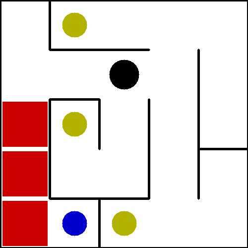
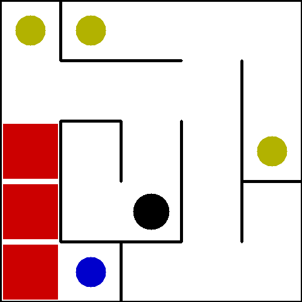
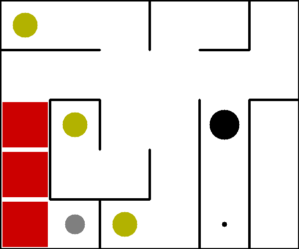

# Object Discovery in Novel Environments for Efficient Deterministic Planning

Hello! This repository stores the code for my master's thesis, titled Object Discovery in Novel Environments for Efficient Deterministic Planning.
The full thesis can be viewed [here](Masters%20Thesis.pdf).

If you are a future student and want detailed information on the structure of this repository and ideas
for further research work, please see [here](documentation.md).

## Visualizations

The following displays show the algorithms I developed in action. Check out my paper for more info.

### The FO-OO-MDP Learner

Here, the agent needs to discover, from scratch, what each object in the environment does.

### Logic-Based Object Discovery

After training on the above environments, the agent is dropped back in but this time, the identities of each object are scrambled.
The agent has to figure out which is which by interacting with them.

### Simplest-Explanation Object Discovery

Unlike logic-based object discovery, simplest-explanation object discovery works even in the presence of new objects the agent
didn't encounter when training in the previous environment. Here, the agent has never encountered the grey circle
(a passenger, which it must carry to the black dot), and must discover this functionality.

